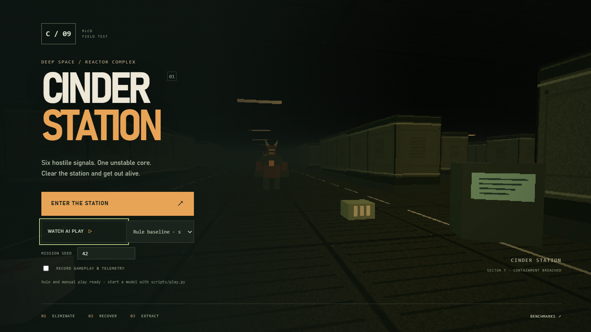
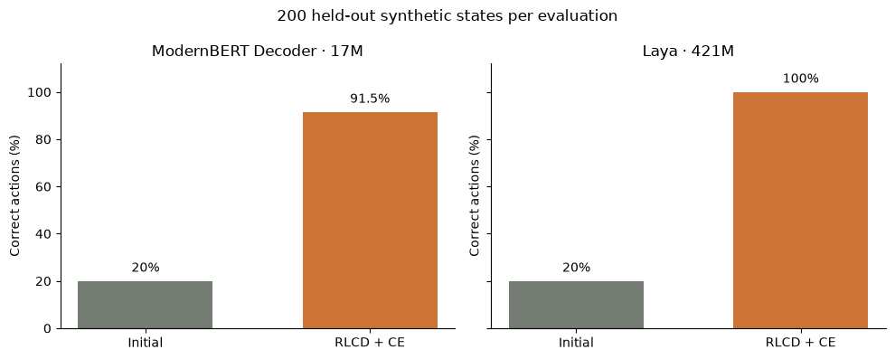

# LAYA-RLCD · Cinder Station

**Train a tiny tactical pilot. Watch it make a terrible decision. Find out why.**

A hands-on lab for **Laya**, **RLCD**, **ModernBERT Decoder**, and **TypeSafe Jev**, with Colab lessons, inspectable experiment evidence, and an original Doom-inspired browser game.



The mission is simple: defeat six hostiles, recover the reactor core, and escape. Your model reads a text state and chooses `attack`, `heal`, `resupply`, `collect`, or `extract`. The shared game motor handles movement, targeting, and aiming. You can also take the controls yourself.

**[Enter the learning lab](https://laya-cinder-station-report.shyam-sridhar16.chatgpt.site)** — play in your browser, open both Colab lessons, inspect the benchmark evidence, meet Jev, and try the interactive tactical-rule lesson. The site also preserves the original Laya field report and recorded gameplay. Browser play offers manual, rule, and random pilots; use the local setup below to connect model inference.

## Play first

Install **Python 3.11–3.13**, **Node.js 22 LTS**, and Git. Then:

```bash
git clone https://github.com/shyamsridhar123/LAYA-RLCD.git
cd LAYA-RLCD
python scripts/setup.py
python scripts/play.py
```

Open **http://127.0.0.1:8765**. Choose **Enter the station** for manual play or **Watch pilot play** with the rule/random baseline. This first step needs no model download, GPU, or API key. If the port is occupied, add `--port 8766`.

| Control | What it does |
|---|---|
| W A S D | Move / strafe |
| Mouse or left/right arrows | Aim |
| Click or Space | Fire |
| Esc or the Ⅱ button | Pause; choose Resume to continue |
| Tab or the telemetry button | Inspect the pilot, state, probabilities, and map |
| On-screen arrows and Fire | Touch controls on a phone/tablet |

Enable **Record gameplay & telemetry** before starting to download a WebM and JSON debrief afterward. Recording stays in your browser; it does not upload to a service. The original art, geometry, and sounds are generated in code. No Doom game files are required or included.

### Share a standalone game

After setup, build a single HTML file with the same simulation, rendering, and controls:

```bash
npm run build:standalone
```

Open or share `game/dist/cinder-station.html`. It includes manual, rule, and random pilots and does not call a model service. This is also the game embedded in the learning lab. For LAYA, ModernBERT Decoder, or Jev, run the local bridge below. The standalone file uses WebGL; fullscreen and recording depend on browser support.

## Pick your next mission

| Lesson | Open in Colab | You will learn |
|---|---|---|
| [1 · ModernBERT Decoder](notebooks/01_modernbert_decoder_colab.ipynb) | [Train a 17M pilot](https://colab.research.google.com/github/shyamsridhar123/LAYA-RLCD/blob/main/notebooks/01_modernbert_decoder_colab.ipynb) | Put RLCD + cross-entropy on a causal decoder with a five-action head |
| [2 · Laya](notebooks/02_laya_colab.ipynb) | [Train the station commander](https://colab.research.google.com/github/shyamsridhar123/LAYA-RLCD/blob/main/notebooks/02_laya_colab.ipynb) | Fine-tune a decision model, select a checkpoint, and calibrate confidence |
| [3 · Evidence walkthrough](notebooks/03_results_walkthrough.ipynb) | [Read the mission debrief](https://colab.research.google.com/github/shyamsridhar123/LAYA-RLCD/blob/main/notebooks/03_results_walkthrough.ipynb) | Recompute results and investigate the decoder's mistakes; no GPU needed |

Training lessons need a fresh Colab **T4 GPU** runtime. They contain the public scripts/data, verify their hashes, and export both results and weights. They do not mount Google Drive or require API keys. The new lesson wrappers have validated code and embedded payloads; the archived reference training was run separately on Colab. The evidence walkthrough has been executed and includes its charts.

## Run the LAYA and ModernBERT Python scripts

Both training implementations are included as readable, standalone Python scripts. The Colab lessons package these same files:

| Model | Training script | Run order | Colab lesson |
|---|---|---|---|
| **LAYA** | [`scripts/finetune_colab.py`](scripts/finetune_colab.py) | `train`, then `finalize` (calibration and test evaluation) | [LAYA notebook](notebooks/02_laya_colab.ipynb) |
| **ModernBERT Decoder** | [`scripts/modernbert_decoder_colab.py`](scripts/modernbert_decoder_colab.py) | `train`, then `evaluate` | [ModernBERT notebook](notebooks/01_modernbert_decoder_colab.ipynb) |

Use the dependency-install cell in either training notebook to prepare a CUDA GPU environment with the pinned experiment packages. The local game setup installs CPU PyTorch; use the notebook's GPU setup for training. From a cloned repository in that GPU environment, give each model its own fresh run directory:

**LAYA — train the station commander:**

```bash
python -c "import shutil; shutil.copytree('data', 'runs/laya/data')"
python scripts/finetune_colab.py train --root runs/laya
python scripts/finetune_colab.py finalize --root runs/laya
```

**ModernBERT Decoder — train the 17M pilot:**

```bash
python -c "import shutil; shutil.copytree('data', 'runs/modernbert/data')"
python scripts/modernbert_decoder_colab.py train --root runs/modernbert
python scripts/modernbert_decoder_colab.py evaluate --root runs/modernbert
```

Each run saves its trained checkpoint under `selected/` and measured results under `results/` inside its run directory. Choose a new directory for another experiment. In Colab, download those files before ending the runtime; the matching lesson includes checkpoint and results export cells.

## Put a model in the cockpit

**Public Laya base checkpoint** (~843 MB download, plus dependencies):

```bash
python scripts/setup.py --download-laya
python scripts/play.py --model laya
```

**Your Colab-trained Laya or decoder:** download the checkpoint ZIP from the lesson, extract its `selected/` directory under `models/`, then:

```bash
python scripts/setup.py --models
python scripts/play.py --model decoder --model-dir models/selected
# For a Laya export, use --model laya instead.
```

The setup installs CPU PyTorch for portable local inference. CUDA users can install their platform's compatible CUDA-enabled PyTorch and add `--device cuda`. Checkpoint weights are not bundled here. In particular, the reference trained decoder weights were not retained: use lesson 1 to produce your own.

**TypeSafe Jev:** use your own TypeSafe account/key. The launcher asks for it privately:

```bash
python scripts/play.py --jev
```

Select **Jev · TypeSafe** in the menu. This sends the synthetic game state and action question to TypeSafe and uses your account. Keys stay on the local server. The default model is `jev-1.13.0`; service availability may change. Read the [Jev guide](docs/JEV.md) for the API shape and a tiny client example.

## What actually happened

Archived runs from September 21–23, 2026; each accuracy below uses **200 balanced, held-out synthetic states**. Both training runs used a Tesla T4 and selected epoch 4 by validation accuracy/NLL.

| Pilot | Before training | After RLCD + CE | Training / validation / saves | Peak allocated GPU memory |
|---|---:|---:|---:|---:|
| ModernBERT Decoder · 16.86M parameters | 40/200 (20%) | **183/200 (91.5%)** | 45.38 s | 0.369 GiB |
| Laya · 421.29M parameters | 40/200 (20%) | **200/200 (100%)** | 285.93 s | 7.080 GiB |



The decoder starts with a new random task head; Laya starts from its pinned public decision checkpoint. Training time excludes installation and initial download/load. These runs establish feasibility on this task. **There is no CE-only ablation, so they do not establish RLCD's additional benefit.**

On five seeds of the same game map, trained Laya and the rule pilot each won **5/5**; base Laya and random each won **0/5**. A separate **single Jev demo** won with 11 decisions and a 165.4 ms median browser request time. There is no measured decoder gameplay result. Different inference deployments and timing boundaries prevent a controlled speed ranking.

The [full benchmark report](docs/BENCHMARKS.md) includes timings, precision, errors, sources, and limitations. The repository retains **1,200 test predictions, 504 optimizer-update records, 20 mission traces, and 11 Jev decisions**. You can check them without running any model:

```bash
python scripts/verify_benchmarks.py
npm run verify:replays
```

## Learn by breaking things

Start with the [learning guide](docs/LEARNING.md), then pick one challenge:

- **The one-HP puzzle:** compare health 34 and 35. Can your model respect a strict threshold?
- **The overconfident cadet:** find a wrong action with high confidence. What does the score really measure?
- **The new-map exam:** build a map the pilot has never seen. Report all seeds, including failures.
- **The fair-loss duel:** compare CE-only and RLCD + CE with the same data, compute budget, and multiple seeds.

Model failures stop the pilot; the game never silently substitutes a rule action. Keep reference evidence fixed and save new runs under `runs/`.

See [CONTRIBUTING](CONTRIBUTING.md) for development and experiment recipes, [privacy](docs/PRIVACY.md) for publication hygiene, and [attributions](NOTICE.md) for upstream projects. This project is an independent educational experiment, with no endorsement implied. Original repository code and synthetic data are provided under [Apache-2.0](LICENSE); upstream packages, models, and services retain their own terms.
