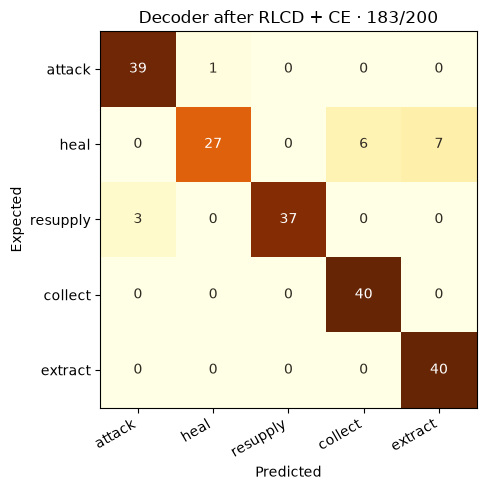

# Reference experiments and their limits

The retained experiments show that Laya's RLCD + cross-entropy recipe can train both Laya and an Ettin ModernBERT Decoder action classifier on a Colab Tesla T4. They measure a small, labeled synthetic task. There is no CE-only comparison, no generative-RL claim, and no measured decoder gameplay result.

## Dates and evidence

| Experiment | Recorded UTC date | Evidence |
|---|---|---|
| Laya T4 training | September 21, 2026 | [Environment](../benchmarks/laya/environment.json), [training](../benchmarks/laya/training.json), [manifest](../benchmarks/laya/manifest.json) |
| Jev single mission | September 22, 2026 | [Demo](../benchmarks/jev/demo.json), [11 decisions](../benchmarks/jev/decisions.json), [CSV](../benchmarks/jev/decisions.csv) |
| Decoder T4 training | September 23, 2026 | [Environment](../benchmarks/decoder/environment.json), [training](../benchmarks/decoder/training.json), [evaluation](../benchmarks/decoder/evaluation.json) |

Mission seeds such as `20260926` are integer random seeds, not dates of execution. Five evaluation seeds use the same handcrafted map; they are not five different maps.

The [lineage manifest](../benchmarks/lineage.json) records source hashes and transformations used to make the public evidence. Those hashes describe retained source artifacts; they are not a claim that unpublished source files can be independently retrieved. The public verification scripts check the published records themselves.

## Task and selection

The five action labels are `attack`, `heal`, `resupply`, `collect`, and `extract`, in that order. Labels follow the explicit priorities in [the protocol](../data/protocol.json). They are generated from game rules. The 1,000 examples are group-disjoint by health, ammo, enemy count, medkits, ammo crates, and core possession, with balanced labels in each split:

| Split | Examples | Purpose |
|---|---:|---|
| Train | 500 | Gradient updates |
| Validation | 100 | Maximum accuracy, then minimum NLL checkpoint selection |
| Temperature | 100 | Laya post-selection calibration |
| Gate | 100 | Laya empirical confidence threshold |
| Test | 200 | Final evaluation; 40 cases per action |

Both runs use seed 1729, four epochs, microbatch two, four accumulation steps, four reward samples, backbone LR 2.5e-5, head LR 1e-4, weight decay 0.01, and sigma 0.4 → 0.1. Each completes **252/252 updates with zero skips** and selects epoch 4. The RLCD proper-scoring reward is combined with cross-entropy. No reward is obtained from the live game.

Reference runtime: **Python 3.13.15, Torch 2.11.0+cu128, CUDA 12.8, Tesla T4 (14.563 GiB)**; Laya 0.3.4, Transformers 5.0.0, Hugging Face Hub 1.29.0, Safetensors 0.8.0. Decoder NumPy is 2.1.3. These are recorded versions, not a promise of Colab's current image. The notebooks preserve the runtime's existing CUDA Torch and print the actual environment.

## ModernBERT Decoder

Checkpoint: [`jhu-clsp/ettin-decoder-17m`](https://huggingface.co/jhu-clsp/ettin-decoder-17m), revision `728fb5b6b3dc5916aa20829c027143ae8eca4eeb`. Architecture: `ModernBertDecoderForSequenceClassification`, **16,864,512 parameters**, full backbone and new task head. A last-non-padding-token head sees the question, options, and complete state. The initial task head is random; this baseline is not a zero-shot text-generation evaluation.

| Metric | Initial random task head | Selected RLCD + CE |
|---|---:|---:|
| Test correct | 40/200 | 183/200 |
| Accuracy | 20.0% | 91.5% |
| NLL | 1.745392 | 0.813109 |
| Multiclass Brier | 0.843984 | 0.155430 |
| T4 median latency | 9.008 ms | 11.875 ms |
| T4 p95 latency | 10.951 ms | 16.739 ms |

Training/validation/checkpoint saves take **45.380 s**, excluding package installation and initial download/load. Peak CUDA memory is **0.368525 GiB allocated / 0.408203 GiB reserved**. The run uses FP32 weights, forward, and backward. A preliminary FP16 attempt had gradient overflows; its results are not substituted for this completed FP32 run.

Validation correct counts progress from 20/100 initially to 75, 92, 93, and 95/100. The [RL-only gradient probe](../benchmarks/decoder/gradient-check.json) reports backbone norm 12.1771 and classifier norm 33.0983. It establishes gradient flow through the reward estimator, not a causal performance benefit over CE.



Per-action correct/40: **attack 39, heal 27, resupply 37, collect 40, extract 40**. The aggregate accuracy hides the weaker heal behavior. The model's probabilities are uncalibrated.

The trained decoder weights from this reference run were **not retained**. The scripts, training trace, settings, gradient check, and all 400 initial/trained predictions are retained. Lesson 1 retrains and exports a new checkpoint; matching every original weight or latency is not guaranteed. No decoder mission outcome is reported.

## Laya

Checkpoint: [`convaiinnovations/laya`](https://huggingface.co/convaiinnovations/laya), revision `1c5edc17a7acd8701df6fc341c0d179f1c62c982`; base weights SHA256 `891102d372688fc2a094dac56a384bc537b87c63f21f9f3dac0be2b7cbc8d86c`. The model has **421,293,827 parameters**. Upstream source reference: `42626c348753fbb17572a813127df2278a1ec527`.

| Metric | Public base | Selected RLCD + CE |
|---|---:|---:|
| Test correct | 40/200 | 200/200 |
| Accuracy | 20.0% | 100.0% |
| T4 median latency | 43.475 ms | 42.189 ms |
| T4 p95 latency | 89.194 ms | 53.672 ms |
| Separate CPU HTTP median | 620.532 ms | 861.876 ms |
| Separate CPU HTTP p95 | 925.590 ms | 1,623.853 ms |

Training/validation/saves take **285.932 s**, excluding installation and initial download/load. The retained timing field also names the reference artifact-copy step. Peak CUDA memory is **7.079779 GiB allocated / 7.828125 GiB reserved**. Training uses FP32 weights with FP16 autocast/GradScaler; exports use FP16. Selection uses in-memory FP32 weights with FP16 autocast; calibration and test reload the selected FP16 export.

Temperature **1.6595869064** is selected by NLL on the temperature split. Gate threshold **0.0** is the lowest candidate accepting at least 20 gate cases with zero observed errors. It accepts all 200 test cases with zero errors in this retained test. These observations do not certify future error rates or establish generalization beyond the synthetic template. Laya's stored prediction probabilities are rounded to four decimals, so exact logit-level NLL cannot be reconstructed from them.

The separate CPU rows are browser-free local HTTP service measurements, not T4 measurements. They retain 400 additional predictions and [base](../benchmarks/laya/cpu-base-summary.json)/[trained](../benchmarks/laya/cpu-trained-summary.json) summaries. Large weights are not bundled in the repository; use the Laya lesson to generate/export a checkpoint.

## Missions and the Jev demonstration

| Pilot | Wins / missions | Map coverage |
|---|---:|---|
| Rule | 5/5 | One map, five seeds |
| Random | 0/5 | Same map and seeds |
| Base Laya | 0/5 | Same map and seeds |
| Trained Laya | 5/5 | Same map and seeds |

See the [20 episode summaries](../benchmarks/gameplay/episodes.json) and complete [action/state/event traces](../benchmarks/gameplay/traces). A replay uses recorded tactics through the shared motor. It verifies consistency of the trace, not that a newly loaded model will choose the same actions.

The separate **`jev-1.13.0` demo** uses seed `20260926`: one win, six kills, core recovered, **74 HP**, **20.65 simulated seconds / 23.0125 wall seconds**, and **11 decisions with zero fallback**. One separate smoke request is excluded from these metrics.

| Jev timing boundary | Median | p95 | Sample |
|---|---:|---:|---:|
| Browser → local bridge → TypeSafe → browser | 165.400 ms | 265.800 ms | 11 requests |
| Local server → TypeSafe → local server | 150.694 ms | 254.735 ms | Same 11 requests |

Jev p95 uses nearest rank; with 11 observations, it equals the maximum. Both timing boundaries include network and service time. This is **one demonstration**, not a general Jev benchmark, a robust win-rate estimate, or a controlled model speed comparison.

## Definitions and reproducibility

- **Accuracy:** correct action count divided by the 200 test states.
- **NLL:** mean negative log probability of the expected action.
- **Brier:** mean sum over all five actions of squared probability error against the one-hot label; not divided by the number of actions.
- **T4 latency:** sequential batch-one calls, three warmups, tokenization and inference, CUDA synchronization. Decoder also includes returned CPU logits; Laya includes upstream answer decoding. Excludes loading, HTTP, and rendering. T4/CPU p95 values use linear interpolation.
- **Training wall time:** the intervals named in the tables, including validation/saves. It is not end-to-end time from opening Colab.
- **GPU memory:** Torch's allocated/reserved peaks, not total GPU or machine memory.

Run these from the repository root:

```bash
python scripts/verify_benchmarks.py
npm ci
npm run verify:replays
```

The first command checks split hashes/labels/disjointness, 1,200 prediction records and latency statistics, decoder NLL/Brier, 504 update records, calibration selection, Jev CSV/timing reconciliation, and source hashes. The second verification replays all 20 mission traces plus the Jev outcome. The [executed walkthrough](../notebooks/03_results_walkthrough.ipynb) computes its figures from these public records.

The public training lessons are new wrappers around retained reference scripts. Their format, Python syntax, and embedded file hashes are checked; the new wrappers have not themselves been rerun through GPU training for this publication. The reference training scripts were run in the environments above. Reproducibility here means inspectable inputs, algorithms, outputs, and a runnable replication path, with this validation boundary disclosed.

The frozen evidence does not answer whether RLCD beats CE alone, whether the pilots generalize to new maps/wording, or which model is intrinsically fastest. Those are good next experiments.
